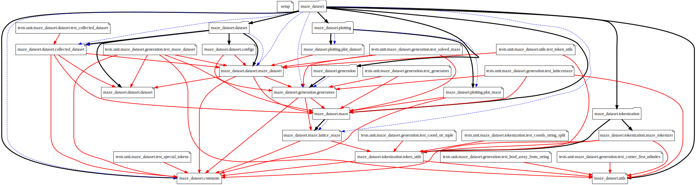
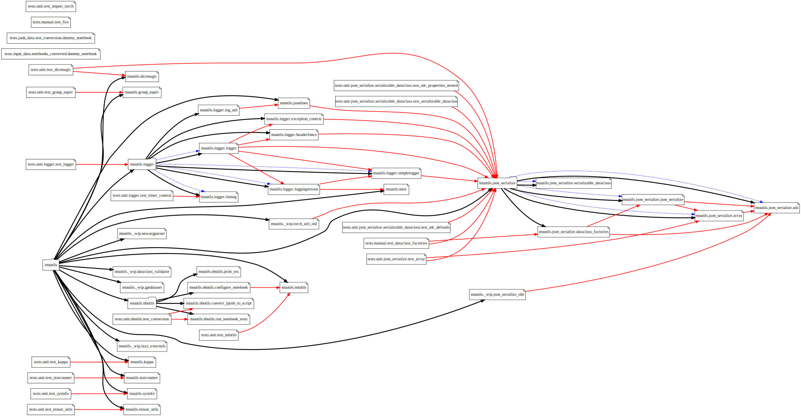

# dep-graph-viz

visualize a dependency graph for a python library



Given a python library (or any folder of python files), create a graph of the dependencies between the modules. By default:

- parent folder has a black arrow to child folders or files
- imports between files are red arrows
- imports in an `__init__.py` from a downstream file are dashed blue arrows

The script also lets the git remote url be auto-detected, making all the nodes in the graph into clickable links (for svg, at least)



(you can view more examples in the [examples](https://github.com/mivanit/dep-graph-viz/tree/main/examples) folder)

# Usage

To generate a graph:
```
python -m dep_graph_viz <library_path> <output_base> [optional-arguments]
```

To print help message:
```
python -m dep_graph_viz -h
```

Below are the contents of that help message:

## Positional or keyword arguments
- `root: str` (REQUIRED)
	root directory to search for Python files
- `output: str`
	output filename (without extension)
	default: `"output"`
- `output_fmt: Literal["svg", "png"]`
	output format for running `dot`
	default: `"svg"`

# Keyword-only arguments
- `config_file: str | None = None`
	path to a JSON file containing configuration options
- `print_cfg: bool = False`
	whether to print the configuration after loading it -- if this is set, the program will exit after printing the config
- `verbose: bool = False`
- `h` or `help`
	print this help message and exit

# Configuration options
Either specify these in a json file, or separate levels with a dot.
- `url_prefix: str|None`
	manually add a prefix to the url. if set to `None`, will try to auto-detect from git
- `auto_url_format: str|None` 
	how to format a url given the git remote url and branch name.
	default: "{git_remote_url}/tree/{git_branch}/" (which works for github)
	set to `None` to disable. if both this and `url_prefix` are none, the svg will not have URLs
- `auto_url_replace: dict[str,str]`
	string-replace pairs to apply to the git remote url before formatting it
	note: trailing slashes are also stripped
	default: `{".git": ""}`
- `node.dir: dict|None` 
	kwargs for directory nodes
- `node.file: dict|None` 
	kwargs for file nodes
- `edge.heirarchy: dict|None` 
	kwargs for hierarchy edges (i.e. file A is part of module B)
- `edge.uses: dict|None` 
	kwargs for uses edges (i.e. file A imports module B for using it)
- `edge.inits: dict|None` 
	kwargs for init edges (i.e. __init__.py file imports something from downstream of itself)
- `dot_attrs: dict`
    kwargs for the dot graph itself
    default: `{'rankdir': 'TB'}` (top to bottom)
    you can change it via `dot_attrs.rankdir=LR` for left to right, etc.

To modify an element of a dict without specifying the whole dict, you can use "." as a level separator:
```
--edge.uses.color=green
```

# Installation

Install via pip from github
```
pip install git+https://github.com/mivanit/dep-graph-viz
```

You also need [GraphViz](https://graphviz.org), specifically the `dot` layout engine, installed and in your `PATH`.

